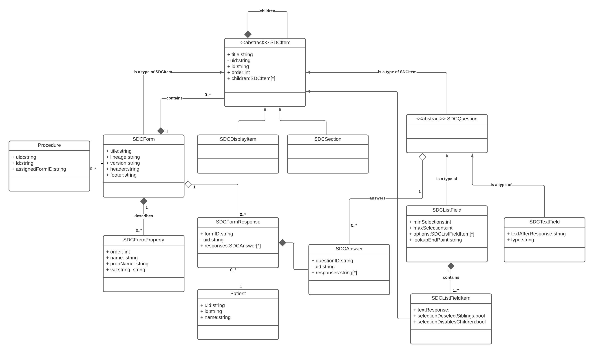
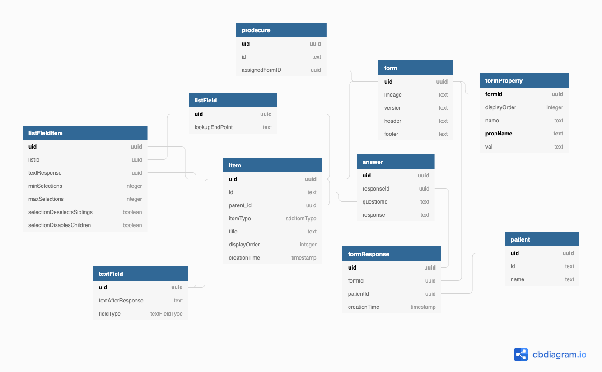
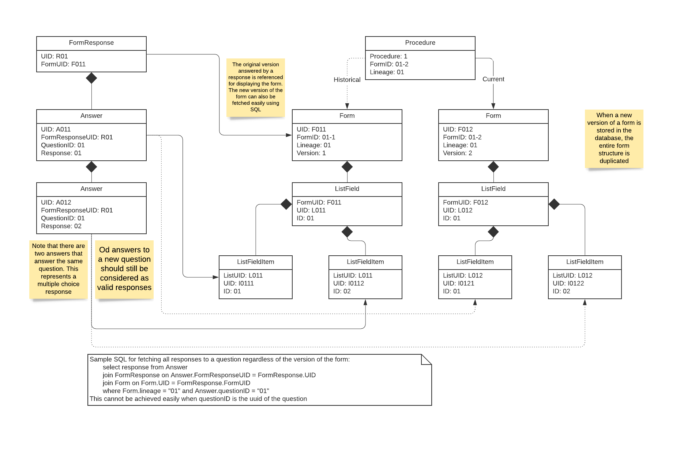

# Model

> Describe the model object behind your API in one or more UML diagrams.

Our data model is derived from the
[official SDC specification](https://www.ihe.net/uploadedFiles/Documents/QRPH/IHE_QRPH_Suppl_SDC_Rev3-0_TI_2019-07-26.pdf)
with the additions of:
- **Procedure**: maps a procedure id to a form
- **Patients**: contains patient information

Complete specifications, including the mapping of XML fields, are documented in
[issue #5](https://github.com/csc302-spring-2021/proj-DaTeam/issues/5)

## UML diagram

## Database diagram

## Data migration and validation strategy

When a form update is submitted, we will store the entire form into the database
instead of just storing or updating the part that is changed.
This allows the admin to revoke the update,
and also allows old responses to be validated after the update.
When a response is submitted, we will fetch the corresponding form for validaton.

For most part of our system,
we will be using uid (uuid) generated by the database to link the objects.
However, for linking the answers with the questions / list options,
we will be using id. Doing so allows all answers to a question be fetched
at the same time regardless of the version of the form.

## Database object diagram

The diagram below shows an exmaple of:
- How multiple versions of the form can be saved in the database at the save time
- How list field questions are stored
- How to fetch all answers to a question regardless of version

