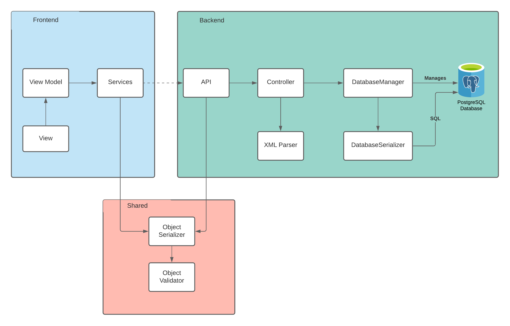
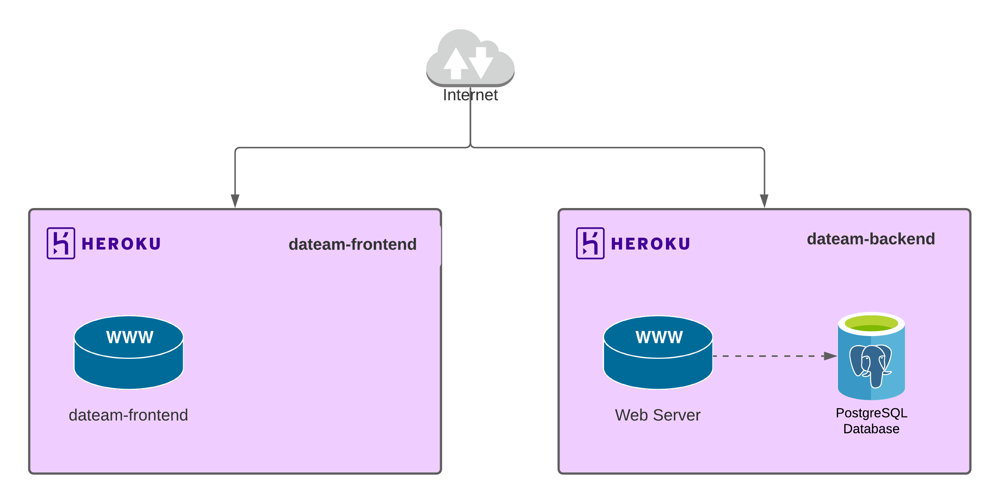

# Technical Product Report

## Proposed Features

For Phase 2, we plan on implementing the following use-cases:

### Create Response

> As a form filler, I want to be able to create a new response for an SDCForm for a particular patient with default values filled in

### Create New Form

> As a form manager, I want to be able to add a new SDCForm to the system and associate it with a DiagnosticProcedureID so that form fillers can use the new form to collect data for that procedure

## What We Actually Built

### What did you actually build during this phase?

- Render a form
- Create a Patient and associate it with a Form Response
- Fetching and displaying all the forms and responses
- Display the form structure for each form
- Parse and store form from XML data
- Create and save form responses
- Persist application data to relational database
- Implemented form response validation (but did not integrate it in our app yet)

### How is this different from what you originally proposed? Why?

- We did not implement saving of responses for all question types
- We did not integrate validation of form responses

## High-level design

- App is sliced up into two parts:
  - Frontend
  - Backend
- Frontend communicates with backend via REST API (as defined in [OpenAPI spec](../../backend/openapi.yml)) on different endpoints and JSON payloads
- Frontend and backend deserialize content from JSON to our own data model classes defined in a shared library
- We have a database mapping layer that translates a given data model instance into the relevant SQL queries needed for CRUD operations
- On the frontend, we divided the app into different routes using React Router and built pages that compose React components to fetch and display data
- On the backend, we divided into services on domain areas:
  - Forms
  - Responses
  - Patients
  - etc.
- In each domain area, we created separate controllers and routes to separate logic for easier unit testing

- In development, we use Docker compose to spin up the frontend, backend, and database as separate containers on the same network
- In production, we deploy the frontend and backend separately as Apps on Heroku due to a limititation of Heroku, they communicate with eachother via HTTP

## Technical Highlights

- **Solution:** Custom ORM for mapping domain models (represented as JavaScript objects) to SQL queries
- **Interesting Bugs:** We are trying our best to avoid database injection when implementing the database manager. However, we are unable to elimiate the risk of database injection for the search function. We are developing a search query system so that the query can be compiled securely within backend server.
- **Observation:** database interaction in tests is hard to work with, [we discussed a couple different approaches](https://github.com/csc302-spring-2021/proj-DaTeam/pull/99#issuecomment-785388981), and settled on mocking out database access layer for unit tests and maybe writing a small number of full-scale End-to-end tests that spin up the full app, including a real database
- **Interesting Bugs:** Some of our serialization logic depends on [reflection](https://en.wikipedia.org/wiki/Reflective_programming) of JS classes to extract constructor types. This lead to an interesting problem when we integrated this serialization code into our frontend app. When developing locally, we had no issues, but when we built our React app for production, we were seeing errors with this part of the code. After a couple minutes of debugging the minified code (not a fun way to debug!), we found out that the cause of the bug was that in production, our tooling was running a minification and obfuscation step that was changing constructor names to make them terser. This was good for performance as it resulted in a smaller bundle size being sent over the network, but it was breaking one of the invariants that we assumed when writing the serialization logic. We investigated some solutions and found two options that were reasonable:

  1. Disable minification - this is the easiest fix, but has the side-effect of increasing bundle size
  2. Replace/reconfigure the built-in minification to avoid stripping class constructor names - this is the better solution, but requires investigation into the settings of Webpack (the bundler used by our build tool)

  We decided that, in the interests of time and considering that the project size is small, we would go with the first option that would allow us to quickly get unblocked. We filed an issue for this problem, so that if we have time at the end of the project, we can come back to it and re-enable minification for better network performance

- Lesson Learned: We initially had a single issue for the parser implementation but this was too big a task for one person, so we decided to split the task up into smaller sub-parser tasks that multiple developers could work on concurrently

## Reflection

### What worked well

- Keeping track of tasks required for this specific milestone and deprioritizing tasks to the next milestone helped ensure that we weren't trying to do too much in a little amount of time (see [Phase 2 milestone on GitHub](https://github.com/csc302-spring-2021/proj-DaTeam/milestone/2))
- Weekly meetings are great opportunities for us to talk about what we are working on, what we are blocked on, and what we want to work on next.
- It was useful to have an extra set of eyes quickly review pull requests before submissions.
- It was often useful to look at [mockups](https://www.figma.com/file/AkEpl4urre2SXIPiAfKulQ/SDC-Form-App?node-id=0%3A1) and [OpenAPI documentation](../../backend/openapi.yml) when discussing implementation to make sure everyone was on the same page.
- VScode Liveshare is a useful tool for us to collaborate on documents simultaneously. This worked well especially while on a group call.
- Labels on our Kanban board helped us organize our tasks; able to filter relevant TODOs. For example: group/backend label for tasks relevant to the backend team, area/tests for tasks related to testing.
- GitHub discord integrations are good way for us all to be in the loop and to see updates.
- Team compatibility 😀
- One big learning point was learning how to coordinate with git branches, rebases, and merge conflicts with teammates as all changes are important

### What needs improvement

- One thing we could work on is providing better feedback in reviewing these pull requests.
- Writing tests helps us to make sure our implementations are correct. However, in the early stages of the development we did not take the full advantage of test driving development by writing the tests first. We have adapoted TDD for the recent PRs and it helps us to ensure the correctness of the commits.
- Diplaying recursive components which could have option which displayed more options which also had children,
  was more difficult that initally imagined as mainly due to the difficult of keeping track of which states belonged to which choices. This was important as the state of other form objects must be depenedant on children. Since disabled components should optimially change it's layout, this was another challenge.

## Next Phase

For phase 3, the final demo, we will implement the following features (ordered by priority):

1. Integrate form validation
1. Patients and Procedures management
1. Filtering and searching for forms and responses
1. Share URL for form response
1. Support non-integer types in text fields
1. Add more tests for backend API
1. Update responses and patients
1. Delete forms and responses
1. Data visualization
